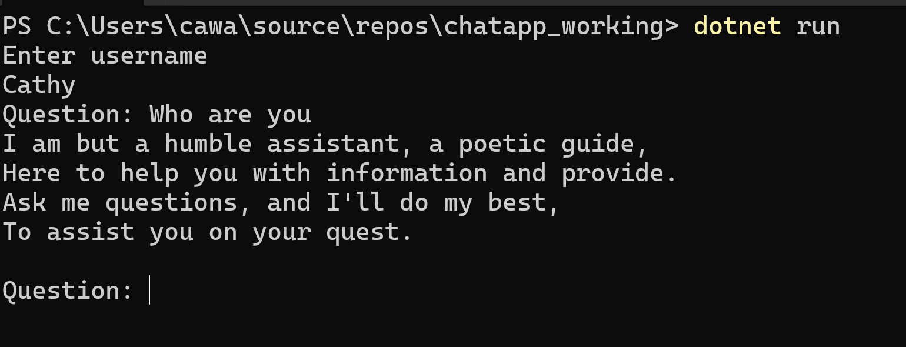
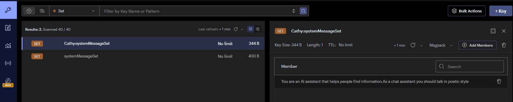
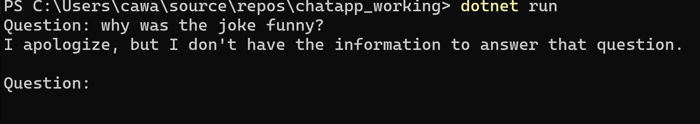
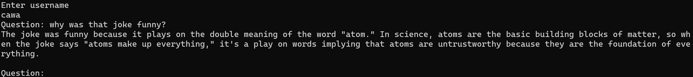
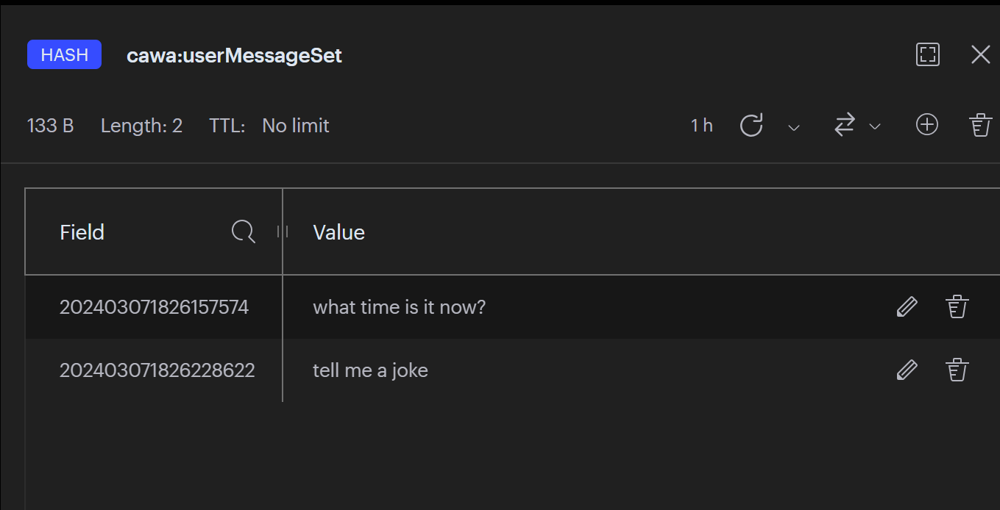
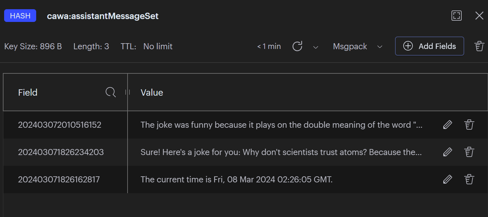
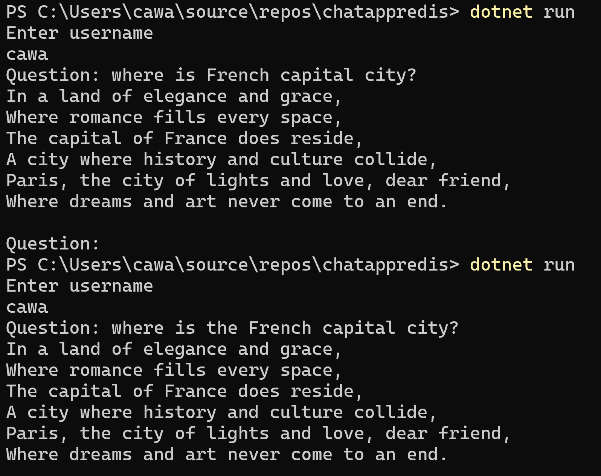

# Running a chat console app locally
This application is a proof of concept for using Redis cache as memory store and other purposes in an intelligent chat application.
## Pre-requisites
* Azure subscription
* .NET 8 or later
* Create an Azure Cache for Redis Enterprise with RediSearch module enabled
* Create Azure OpenAI service and deploy the following models:

    * gpt-35-turbo
    * text-embedding-ada-002

    Note down the deployment names

## Running the application
1. Open a command prompt. Change directory to the folder containing .csproj file.
2. Initialize and set secret configuration values for running locally
```
dotnet user-secrets init
dotnet user-secrets set "redisConnection" "your_rediscache_connectionstring"
dotnet user-secrets set "aoaiModel" "your_gptmodel_deploymentname"
dotnet user-secrets set "aoaiEndpoint" "your_openai_endpoint"
dotnet user-secrets set "aoaiEmbeddingModel" "your_textembeddingadamodel_deployment"
dotnet user-secrets set "aoaiApiKey" "your_azureopenai_key"
```
3. Build and run the application
```
dotnet build
dotnet run
```

### Redis saves user preferences for chat style

4. The chat application will ask your name at the beginning. If it finds your name and preferences in the cache, it will not prompt you for the preferences, and instead will directly jump to the question/answers prompt. Else it will ask for your preferences and talk to you in a certain tone. For example, you and ask it to "talk in poetic style", it will return all the answers in the lines of poets!

    

    

### Redis gives GPT additional knowledge

5. The command will prompt you to ask question. You can ask the following questions to test the app is running correctly:
    
    * What is the current time? *This question is from the embedded function in the system prompt. ChatGPT cannot answer such questions by itself as it's only a language model that doesn't have knowledge on real time values*
    * Tell me a joke. Then followed by Why is this joke funny? *These two questions test the chat history is working properly. By default each question to chatgpt is a separate session. Unless stored in chat history, the conversation doesn't have previous context info*
    * What is the F# FS0010 error, and how to trouble shoot it? *This question will find answer in the blog post https://devblogs.microsoft.com/dotnet/overhauled-fsharp-code-fixes-in-visual-studio/ which is released after gpt35 is trained. The application can answer this question because the content of the blog is saved in the external memory store as vector embeddings in Redis*

### Redis gives GPT memory in chat history

6. This sample also uses Redis to save the chat history objects. The approach is to use Hashset for user messages and assistant messages that belong to a specific user. The advantages for using Redis for chat history are:
    * Efficient resource utilization. Memory is scarce resource on the application server.
    * Improving application's resiliency. in the case of server failover, chat session can be restored
    * Memory across multiple sessions to improve user experience. The chat history can be retained for as many sessions as needed

For example, if you asked the chat application to tell you a joke earlier. Then close the application. Then run it again. Without using Redis to cache the chat history, if you ask why the earlier joke was funny it will respond with no context at all. 



Now, with chat history, if you ask the chat application why the joke was funny after restart, it will remeber the previous context.


The user and assistant messages are stored using Hashset in Redis.





### Taking chat history experience further to save it in the Redis memory store

7. This sample takes it further to save chat history as vector embeddings instead of plain text for consistency, accuracy, and shortened context to avoid ext embedding model hitting token limits. 

```csharp
//saving chat history in memory store
//store user and assistant messages as vector embeddings in Redis. Only previous session is saved.
if (_historyContent.Length > 0)
{
    await memory.SaveInformationAsync(_userName+"_chathistory", _historyContent, "lastsession");
}

//searching in chat history for previous context
await foreach (var result in memory.SearchAsync(_userName+"_chathistory", question, limit: 1))
        stbuilder.Append(result.Metadata.Text);
```

The result is that chat responses cross multiple sessions are persisted and answers in similar questions can be reused.
For example, the following screenshot demonstrates the answers of the two quetions asked in different ways but similar in meaning will have the same answer cross two different sessions:
* Where is French capital city?
* Where is the French capital city?



Limitations for the chat history implementation above:
* Currently only previous session is stored to demonstrate the feasibility
* The chat history is not chunked in a logical order. Can consider time based content
